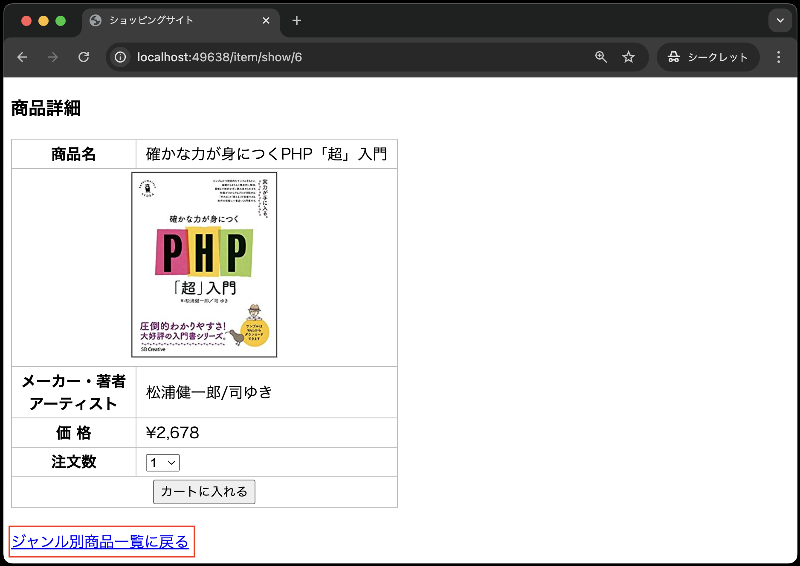
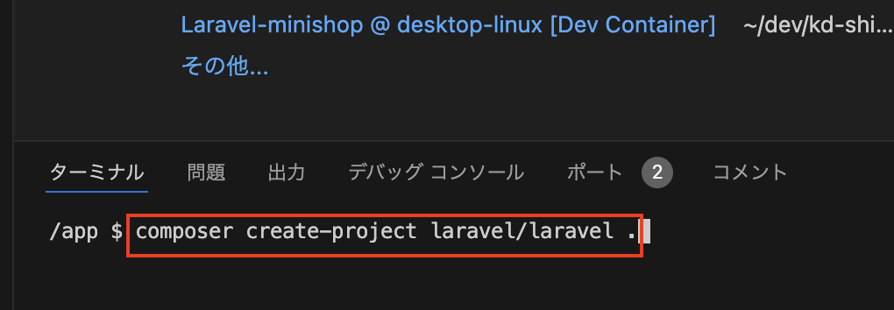
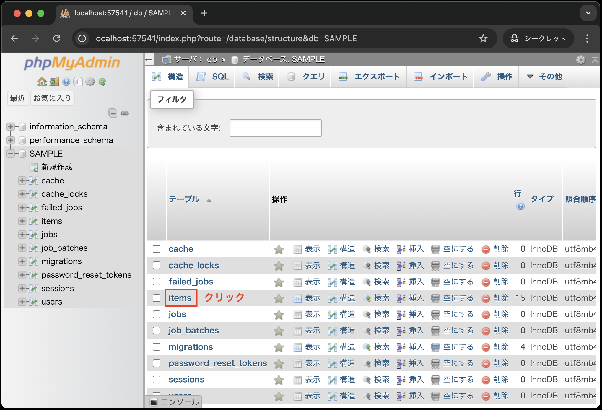
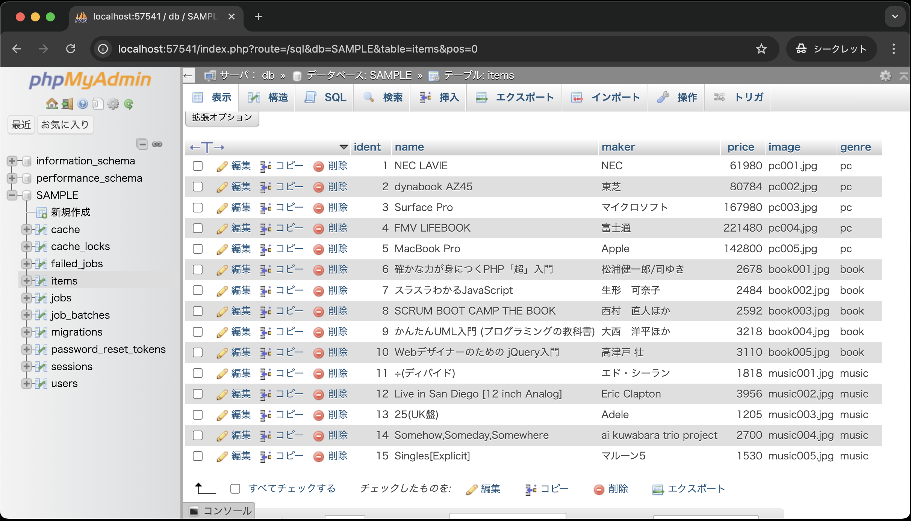
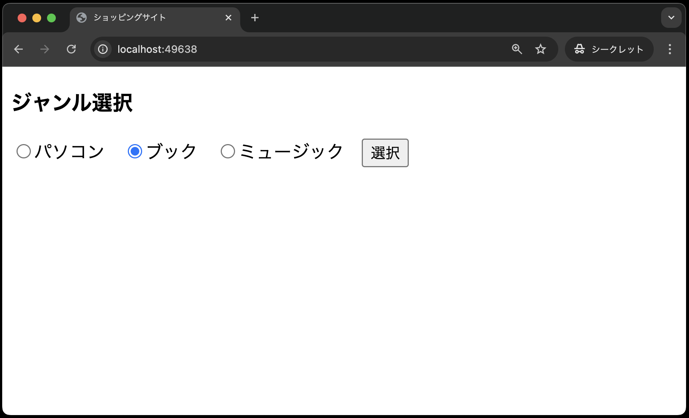
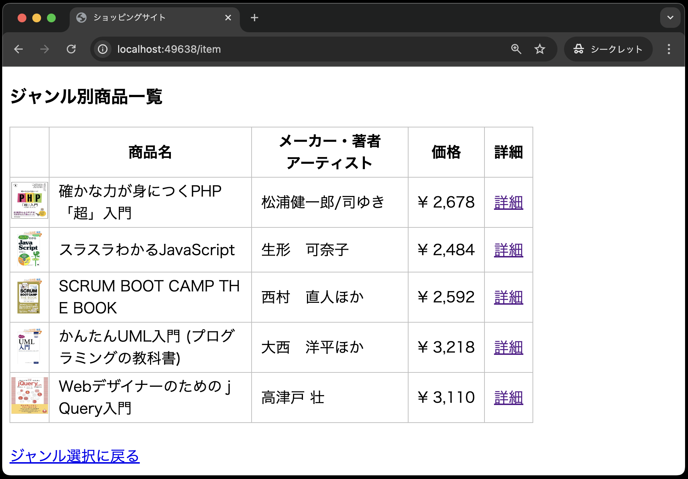
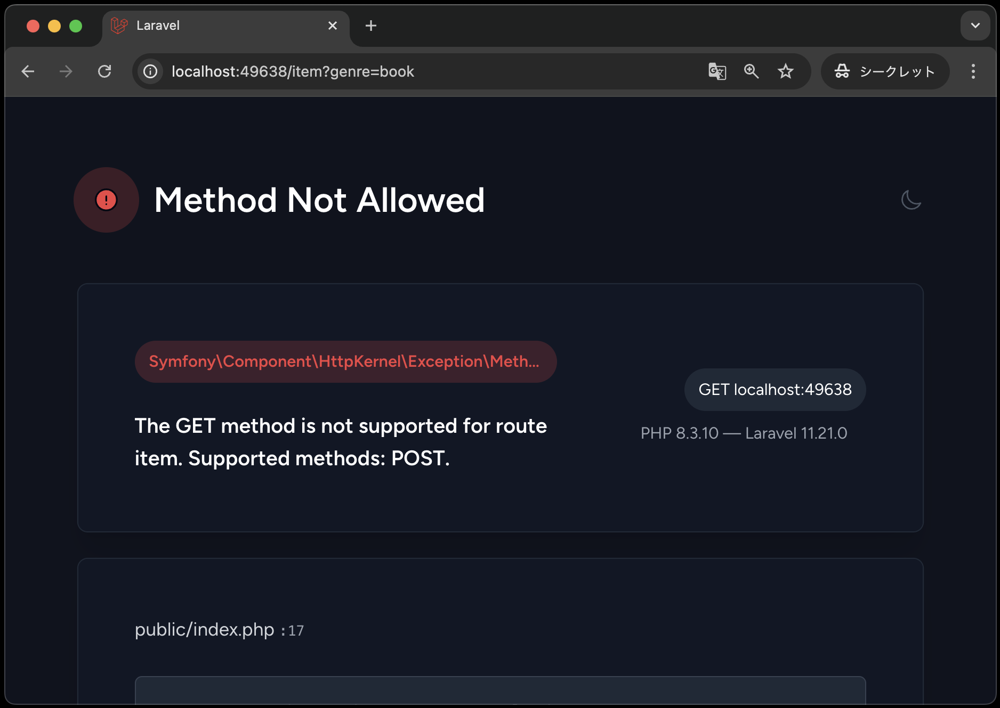

# 課題の説明

以下に、商品詳細画面の仕様を再掲します。



- ジャンル別商品一覧から選択された商品の詳細画面を表示する
- 注文数のプルダウンメニューとカートに入れるためのボタンがある

## ①Laravel環境の構築

1. VSCode上で、`Ctrl+Shift+P`(Macの場合は`Cmd+Shift+P`)を押し、コンテナを起動する
2. VSCode上で、`Ctrl+J`(Macの場合は`Cmd+J`)を押し、ターミナルを表示する
3. ターミナルに`composer create-project laravel/laravel .` と入力し、`Enter`で実行する<br>
   
4. [【課題】ジャンル別商品一覧画面の作成](https://2025web2.github.io/22-asgmt-shop-item-index-text/)までで作成した以下のコードを、上記「1.」でcloneしたソースコードと同じ場所に上書きする
   
   ```text
    app
    ├── Http
    │   └── Controllers
    │       └── ItemController.php
    ├── Models
    │   └── Item.php
    │
    途中省略
    │
    database
    ├── migrations
    │   └── 20XX_XX_XX_XXXXXX_create_items_table.php
    ├── seeds
    │   ├── DatabaseSeeder.php
    │   └── ItemTableSeeder.php
    public
    ├── css
    │   └── minishop.css
    ├── images
    │   └── xxx.png(15個の画像ファイル)
    │
    resources
    ├── views
    │   ├── items
    │   │   └── index.blade.php    
    │   └── index.blade.php
    routes
    ├── web.php
    │
    途中省略
    │
    .env
    ```

5. コマンドでマイグレーションとシーダーを実行する(※コマンドを忘れた人は、[モデル、コントローラ](https://2025web2.github.io/02-model-controller/)の章を参照すること)
6. phpmyadminで`items`テーブルが確認できればOK<br>
   <br>
   <br>
   

## ②ルーティングとジャンル別商品一覧画面の修正

商品詳細画面を作成する前に、前回の課題[【課題】ジャンル別商品一覧画面の作成](https://2025web2.github.io/22-asgmt-shop-item-index-text/)で作成したものにいくつか修正が必要です。

### ②−1 ルーティングの修正

---

現状、ジャンル別商品一覧画面の「詳細」リンクをクリックしても商品詳細画面に遷移しません。
そのため、商品詳細画面に遷移するためのルーティングを追加する必要があります。

ルーティングを追加するためには、`routes/web.php`ファイルを以下の観点から修正してください。

- `GET`リクエスト時に`ItemController`の`show`メソッドを呼び出すルートを追加する
- マッピングするURLを`item/show/{xxxx}`に設定する(`xxxx`にはルートモデルバインディングのための名前を指定する※わからなければ[Laravelの便利な実装(ルートモデルバインディング)](https://2025web2.github.io/03-route-model-binding/)の章を参考にすること)
- ルーティングの名前を`item.show`に設定する

### ②−2 ジャンル別商品一覧画面の修正

---

次に、ジャンル別商品一覧画面(`resources/views/item/index.blade.php`)を修正します。
上記の「②-1 ルーティングの修正」を参考に、商品詳細画面に遷移するための詳細リンクを以下の観点から修正してください。

- 詳細リンクの宛先に対象のルーティングを指定する(ルーティングの名前で指定すること)
- 商品IDを渡す(※商品IDを渡すときの名前に注意！わからなければ[Laravelの便利な実装(ルートモデルバインディング)](https://2025web2.github.io/03-route-model-binding/)の章を参考にすること)

## ③コントローラの修正

次に、商品詳細画面のビューを表示するために、`ItemController`(`app/Http/Controllers/ItemController.php`)を修正します。
以下の観点から修正してください。

- `show`メソッドの追加(`show`メソッドの仕様は以下のとおり)
  - ルートモデルバインディングにより、商品IDと一致する商品情報を取得
  - 商品情報をビューに渡す

## ④ビューの作成

次に、ビューとして商品詳細画面を作成します。
`resources/views/item`ディレクトリに`show.blade.php`ファイルを作成し、以下の観点からコードを記述してください。

- コードは前期の[ミニショップ(商品に関する機能の実装)](https://2025web1.github.io/11-minishop-product/item-2.html#%E5%95%86%E5%93%81%E8%A9%B3%E7%B4%B0%E7%94%BB%E9%9D%A2product_detailphp)を参考にし、[Laravelの便利な実装(ルートモデルバインディング)](https://2025web2.github.io/03-route-model-binding/)までの章で学んだ内容を反映させること

  - cssを適用する
  - 商品データの埋め込みには、`{{ }}`を使用する
  - 各種ディレクティブ(`@`から始まるもの)を使用する
  - 注文数のプルダウンは、1から10までの数値を表示するために、以下の例にならって`@for`ディレクティブを使用すること

    ```php
    @for ( $i=1;  $i<=10;  $i++ )
        <option value="{{ $i }}"> {{ $i }} </option>
    @endfor
    ```

  - 「ジャンル別商品一覧に戻るリンク」を作成する(←ただし、この時点ではリンク作成後、クリックするとエラーがでるので、以降の「❻商品詳細画面のバグ修正」で実装する)


## ⑤動作確認(1回目)

では、実際に動作確認を行いましょう。

以下のように、商品詳細画面に遷移するリンクをクリックすると、商品詳細画面が表示されればOKです。





## ⑥商品詳細画面のバグ修正

現状のままだと、商品詳細画面からジャンル別商品一覧に戻るリンクをクリックすると、以下のようなエラーが発生します。




このエラーは、商品詳細画面からジャンル別商品一覧に戻るリンクをクリックした際のルーティング、つまり`GET`リクエストによるルーティングが設定されていないために発生します。
そのため、商品詳細画面からジャンル別商品一覧に戻るリンクをクリックした際に、ジャンル別商品一覧画面に遷移するためのルーティングを追加する必要があります。

`routes/web.php`ファイルを以下のように修正してください。

```php
use Illuminate\Support\Facades\Route;
use App\Http\Controllers\ItemController;

// Route::get('/', function () {
//     return view('welcome');
// });

Route::get('/', function () {
    return view('index');
});
// 以前までのはコメントアウト
//Route::post('item', [ItemController::class, 'index'])->name('item.index');
// --- 以下を追加 ---
Route::match(['get', 'post'], 'item/{genre?}', [ItemController::class, 'index'])->name('item.index');

Route::get('item/show/{item}', [ItemController::class, 'show'])->name('item.show');
```

**【解説】**

`Route::match(['get', 'post'], 'item/{genre?}', [ItemController::class, 'index'])->name('item.index');`: <br>
`Route::match`は、`GET`リクエストと`POST`リクエストの両方を受け付けるルートを定義しています。
第1引数の`['get', 'post']`は、`GET`リクエストと`POST`リクエストを受け付けることを意味します。
第2引数の`'item/{genre?}'`は、商品詳細画面からジャンル別商品一覧に戻るリンクをクリックした際に、ジャンル別商品一覧画面に遷移するためのURLです。
`{genre?}`の`?`は、`POST`リクエスト時にURL末尾にパラメータでジャンルが指定されていない場合でも、問題なく遷移できるようにするためのものです。

また、`resources/views/item/show.blade.php`ファイルのジャンル別商品一覧に戻るリンクを以下のように修正してください。


```php
<a href="{{ route('item.index',['genre' => $item->genre])}}">ジャンル別商品一覧に戻る</a>
```


以上で、商品詳細画面のバグ修正は完了です。

## ⑦動作確認(2回目)

以下のように、商品詳細画面からジャンル別商品一覧に戻るリンクをクリックしても、エラーが発生しないことが確認できればOKです。


